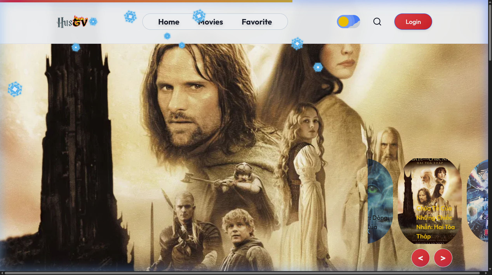
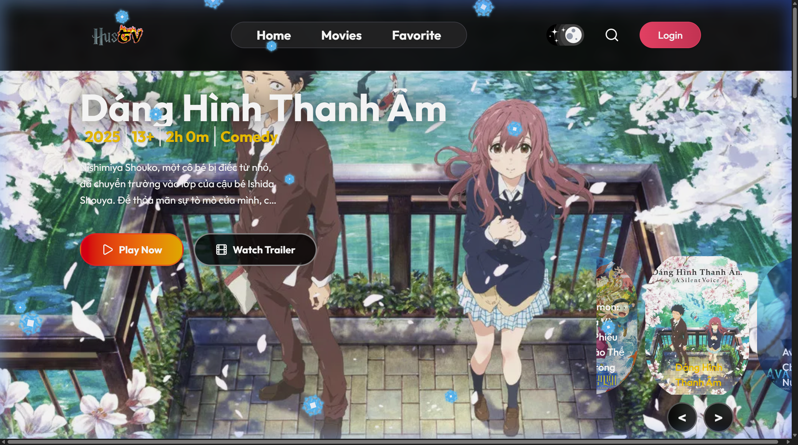
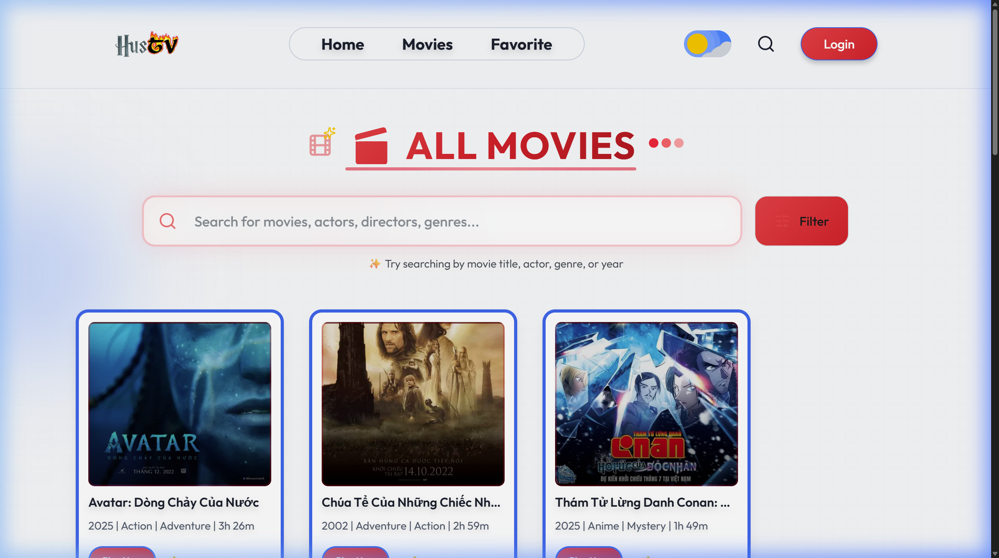
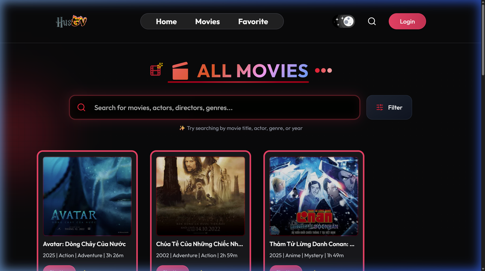

# HusTV - Nền Tảng Xem Phim Trực Tuyến (Movie Streaming Platform)

HusTV là một nền tảng xem phim trực tuyến hiện đại, được xây dựng sử dụng mô hình Client-Server với giao diện đẹp mắt, hỗ trợ chế độ sáng/tối tự động và tích hợp hệ thống thanh toán gói cước thành viên cao cấp.

---

## 📋 Mục Lục
1. [Tính Năng Chính](#-tính-năng-chính)
2. [Công Nghệ Sử Dụng](#-công-nghệ-sử-dụng)
3. [Cấu Trúc Thư Mục](#-cấu-trúc-thư-mục)
4. [Hình Ảnh Giao Diện](#-hình-ảnh-giao-diện)
5. [Hướng Dẫn Cài Đặt & Chạy](#-hướng-dẫn-cài-đặt--chạy)

---

## 🚀 Tính Năng Chính

### 👤 Cho Người Dùng (Client)
* **Xác thực & Bảo mật**: Đăng ký, đăng nhập an toàn qua hệ thống **Clerk** (hỗ trợ Google, Email).
* **Khám phá phim**: Trang chủ đẹp mắt với Hero Carousel giới thiệu phim nổi bật, bộ lọc phim theo thể loại và thanh tìm kiếm thời gian thực.
* **Chi tiết phim phong phú**: Xem trailer, cốt truyện, diễn viên, năm sản xuất, thời lượng và xếp hạng đánh giá từ người dùng.
* **Yêu thích**: Lưu phim yêu thích vào danh sách cá nhân để truy cập nhanh chóng.
* **Gói cước thành viên**: Đăng ký và gia hạn dịch vụ xem phim qua **Stripe Payment Gateway** (đồng bộ qua Stripe Webhook).
* **Trình phát video chất lượng cao**: Trình phát phim chuẩn TV với hiệu ứng phát sáng viền và tự động lưu tiến trình xem phim.

### 👑 Cho Quản Trị Viên (Admin Dashboard)
* **Báo cáo thống kê**: Tổng quan doanh thu, số lượt đăng ký gói, tổng số phim và tổng số người dùng thành viên.
* **Quản lý Phim**: Thêm, sửa, xóa phim (hỗ trợ nhập link phim streaming HLS/MP4, link backdrop, poster, trailer, các thông tin chi tiết).
* **Quản lý Thể loại**: Cấu hình các thể loại phim phong phú.
* **Quản lý Gói cước**: Tạo và thiết lập giá, thời hạn các gói dịch vụ trực tiếp đồng bộ với Stripe.

---

## 🛠️ Công Nghệ Sử Dụng

| Thành phần | Công nghệ / Thư viện |
| :--- | :--- |
| **Frontend** | React 19, Vite, Tailwind CSS v4, React Router DOM v7, Lucide React, React Hot Toast |
| **Backend** | Node.js, Express, Stripe SDK, Inngest (Xử lý hàng đợi/cron), Clerk SDK |
| **Database** | MongoDB, Mongoose |
| **Payment & Auth**| Stripe Checkout & Webhooks, Clerk Authentication |

---

## 📁 Cấu Trúc Thư Mục

```text
HusTV/
├── client/           # Frontend React + Vite
│   ├── src/
│   │   ├── components/  # Các component tái sử dụng (Navbar, Card, SearchBar,...)
│   │   ├── pages/       # Các trang chính và trang quản trị (Admin)
│   │   └── index.css    # Cấu hình Tailwind v4 và các biến CSS theme
└── server/           # Backend Node.js + Express
    ├── controllers/  # Logic điều hướng và xử lý chính
    ├── models/       # Schema MongoDB (User, Video, Genre, Plan, Booking)
    ├── routes/       # Các endpoint API định tuyến
    └── server.js     # Khởi tạo và cấu hình Server
```

## 📸 Hình Ảnh Giao Diện

### 🏠 Trang Chủ - Chế Độ Tối (Default)


### 🏠 Trang Chủ - Chế Độ Sáng


### 🎬 Trang Danh Sách Phim - Chế Độ Tối


### 🎬 Trang Danh Sách Phim - Chế Độ Sáng


---

## 💻 Hướng Dẫn Cài Đặt & Chạy

### 1. Khởi chạy Backend Server
1. Truy cập thư mục server:
   ```bash
   cd HusTV/server
   ```
2. Cài đặt các gói phụ trợ:
   ```bash
   npm install
   ```
3. Tạo file `.env` dựa trên cấu hình mẫu và cấu hình:
   * `MONGO_URI`, `CLERK_PUBLISHABLE_KEY`, `CLERK_SECRET_KEY`, `STRIPE_SECRET_KEY`, `STRIPE_WEBHOOK_SECRET`.
4. Chạy Server ở môi trường phát triển:
   ```bash
   npm run dev
   ```

### 2. Khởi chạy Frontend Client
1. Truy cập thư mục client:
   ```bash
   cd HusTV/client
   ```
2. Cài đặt các thư viện:
   ```bash
   npm install
   ```
3. Tạo file `.env` và cung cấp:
   * `VITE_CLERK_PUBLISHABLE_KEY`, `VITE_API_URL` (trỏ đến backend endpoint).
4. Khởi chạy Client:
   ```bash
   npm run dev
   ```
